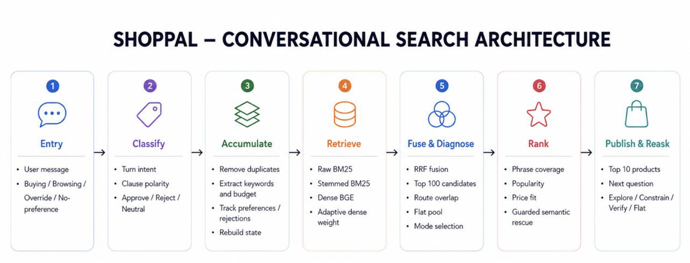

#  ShopPal
## Your lightweight, reliable shopping kaki

**0.8894 TechnicalScore · 0.985 Hit@10 · 0.759 MRR · 38 ms median latency · 91 ms p95 · CPU-only · no inference-time API calls**

## Key Features

### 1. Feasible: lightweight and fast

There is no generative model anywhere in the pipeline. The only neural component is `BAAI/bge-small-en-v1.5`, a 33M-parameter sentence encoder running locally on CPU through ONNX Runtime.

The rest of the system is classical and deterministic:

- SQLite FTS5 for two BM25 indexes;
- NumPy for dense vector search;
- rule-based keyword, phrase, and budget extraction;
- a vendored Porter stemmer;
- Reciprocal Rank Fusion;
- a small deterministic reranking formula;
- an explicit session-state manager;
- a deterministic question-selection policy.

Measured performance on the shipped configuration:

| Metric | Result |
|---|---:|
| Median latency | **38 ms/turn** |
| p95 latency | **91 ms/turn** |
| Agent memory | **577 MB** with the embedding model |
| Estimated inference cost | **$0.00** |
| API calls at inference | **0** |
| Generative model | **None** |

A second stdlib-only configuration removes the local model and external dependencies entirely. It still scores **0.8598** on the public development set, over eight times the starter baseline.

The principle is simple: **use semantic computation where it changes a decision, and use deterministic logic everywhere else.**

### 2. Practical: optimised for the shopper, not the evaluator

#### a. Accomodating for real-world user dialogue ####
The official evaluator is deterministic and template-driven. It is valuable for reproducible development, but its language also creates an overfitting opportunity.

In order to shape our pipeline design to actually tackle the problem statement instead of simply scoring well in a highly simulated environment, we wrote two more independent shopper simulators:

- `tools/realistic_sim.py` paraphrases catalog metadata, answers whichever topic the agent actually asks about, and sometimes volunteers information that was not requested.
- `tools/shopper_sim.py` describes the target more indirectly, with uneven disclosure, repetition, occasional negation, and side questions.

#### b. Ensuring legitimate results ####
Through iterative experimentation, we identified a notable trend in the benchmark: the “Others” attribute can provide two attributes simultaneously within a single turn, which can reduce the number of turns needed to reach the correct product and therefore improve MTTC. While this presented a potential opportunity to optimize directly for the metric, we deliberately chose not to exploit it. Our goal was to improve the agent’s ability to understand and accumulate realistic user constraints, rather than optimize around a dataset-specific artifact. This led us to focus on approaches that would remain meaningful when constraints are naturally introduced across multiple turns in a real shopping conversation.

### 3. Effective: minimal for functionality, not for appearance

The shipped architecture is deliberately small because we repeatedly measured whether each component earned its complexity.

Two changes explain most of the performance gain:

**Conversation accumulation + targeted questioning:** the starter effectively queried from the latest turn. We instead preserved session evidence and asked one useful follow-up question each turn. Together these changes contributed **+0.576 TechnicalScore** in the measured development sequence.

**Retrieval followed by reranking:** broad retrieval and final ranking solve different problems. We retrieve 500 candidates from each of three catalog views, fuse their rankings, then rerank the top 100 using more precise evidence. The reranking stage contributed **+0.156 TechnicalScore** in isolation.

Other ideas were removed when they made the system worse. RM3 pseudo-relevance feedback cost **−0.013**, and carrying the fusion score into the reranker cost **−0.043**. A more elaborate negation/modality parser was also rejected because its richer-language errors could silently reverse a shopper's intent.

The final pipeline therefore contains very little redundant machinery. That is both a performance choice and a reliability choice.

---

## Architecture



### 1. Entry

Each customer message is split into clauses. Each clause is embedded with `BAAI/bge-small-en-v1.5` and compared against **36 prototype sentences**: 12 prototypes for each conversational class.

The three outcomes have different effects:

- **`NORMAL`** — the clause becomes positive evidence.
- **`NO_PREFERENCE`** — the attribute is suppressed rather than assigned an invented value.
- **`OVERRIDE`** — the new value is kept while the old value for that same attribute is marked superseded.

A second classifier is applied to each attribute mention against **31 masked prototypes** (8 approve, 15 reject, 8 neutral). A hard rejection removes that value from positive evidence entirely, while a neutral reading leaves product-composition fragments such as `100% Polyester` as ordinary evidence rather than treating them as stated preferences.

### 2. Classify

The state manager keeps five maps:

| State | Purpose |
|---|---|
| `positive_clauses` | active evidence used for query reconstruction |
| `rejected` | attribute/value pairs the shopper explicitly ruled out |
| `superseded` | attribute/value pairs replaced by a later value |
| `values` | historical values used to determine what a new value supersedes |
| `suppress` | question-suppression weight for each attribute |

Nothing is silently deleted from the historical state. Instead, invalidated information is marked as rejected or superseded, and the derived query is rebuilt from the valid facts on every turn.

A declined attribute receives an initial suppression weight of **3.0**. Suppression then decays by **0.55× per turn**. This prevents the agent from immediately repeating a declined question while still allowing that attribute to become relevant again later.

### 3. Accumulate

The active session state is converted into four search representations:

- plain content words;
- Porter-stemmed terms;
- adjacent-word bigrams and trigrams;
- budget constraints and a combined text representation.

Keyword extraction uses regular expressions, stop-word rules, and the algorithmic Porter stemmer. No machine-learning model is involved in this stage.

### 4. Retrieve

Three independent views of the 50,000-product catalog are queried:

1. **BM25 over raw tokens** using SQLite FTS5;
2. **BM25 over Porter-stemmed tokens** using SQLite FTS5;
3. **Dense cosine similarity** over precomputed 384-dimensional BGE-small vectors.

Each route returns 500 candidates.

The dense route therefore uses a conditional fusion weight rather than a fixed one. The weight is **1.0** when the query has fewer than four terms or when the two BM25 views disagree (top-20 Jaccard overlap below 0.25), and **0.15** when the two views already agree. Lexical evidence remains dominant where it is confident, while semantic evidence receives greater weight where lexical agreement is weak.

### 5. Fuse & Diagnose
The three ranked lists are combined with Reciprocal Rank Fusion:

```text
RRF(score) = Σ weight / (60 + rank + 1)

weight = 1.0 raw BM25, 1.0 stemmed BM25,
         0.15 or 1.0 dense (conditional, see below)
```

Only rank position is used. The underlying BM25 and dense scores are not directly comparable, so they are discarded after generating ranked candidate lists. The top 100 fused candidates move to reranking.

### 6. Rank

The reranker restores evidence that broad OR-style retrieval does not represent well:

```text
0.8 × phrase coverage
+ 0.2 × log1p(review count)
+ 0.3 × budget fit, when a budget is present
```

Phrase coverage measures whether query bigrams survive intact in the product text.

Dense similarity is deliberately **not** used as a reranking feature because carrying it into this stage measured worse. Instead, a guarded semantic rescue promotes a candidate to visible rank 6 only when all three routes independently rank it near the top (fused ≤ 3, raw ≤ 3, stemmed ≤ 3, dense ≤ 5) and the reranker has pushed it outside the top 10.

### 7. Public & Reask

The agent asks one clarification per turn. It selects the least-suppressed attribute using an order determined by the current diagnostic mode. The default broad-to-narrow order is:

```text
feature → use_case → style → material → color
→ size → budget → brand → category
```

Three alternatives replace the default order when the state warrants: `verify` after a rejection or override, `constrain` when too few preferences are known, and `flat` when the fused candidate scores are too close together to provide a clear separation.

The policy is deterministic by design. The goal is not to generate a long conversation; it is to use the 10-turn budget efficiently and collect information that can change the ranking.

---

## Session history and future personalization

The agent's `reset(session_id, user_profile)` interface receives an anonymized profile, and the current reranker uses one tuned parameter set:

```text
phrase     = 0.8
popularity = 0.2
price      = 0.3
```

Those values were tuned against the **single buyer behavior pattern available in the challenge development data**. They therefore reflect the shopper behavior represented in that data, not a claim that the same weights are optimal for every possible shopper.

Different shoppers can rationally require different ranking trade-offs. For example:

- a shopper who strongly values social proof may benefit from a higher popularity weight;
- a shopper with very specific requirements may benefit from putting more weight on relevance and phrase coverage and less on popularity.

With data covering multiple shopper behaviors, session history could be used to turn the fixed parameter vector into a personalized one.

A future implementation would:

1. keep the anonymized shopper's previous purchase sessions and the ranked position of the ground-truth item;
2. after each purchase, optimize the `(phrase, popularity, price)` weights against that shopper's accumulated outcomes;
3. use the resulting weight vector as the starting point for that shopper's next session;
4. repeat the optimization after future purchases so the parameters evolve with the shopper.

The reranking formula would not change. However, instead of one universal parameter vector, the system will use shopper-specific parameter vectors learned from actual outcomes.

We intentionally kept session handling and reranker parameters modular so that this extension is readily implementable.

---

## Results

### Public development set — 200 sessions

The final shipped configuration combines the strongest measured trade-offs rather than the highest intermediate public score. It achieves **0.8894 TechnicalScore** while remaining CPU-only, locally executable, and independent of inference-time API access.

```text
Hit Rate@10     0.985
MRR             0.759
MTTC            2.54
Efficiency      0.846
TechnicalScore  0.8894
```

The challenge defines:

```text
TechnicalScore =
    0.50 × HitRate@10
  + 0.30 × MRR
  + 0.20 × Efficiency
```

The component metrics shown in this README are rounded for presentation; the reported TechnicalScore is the evaluator's score from the underlying metric values, so recomputing the formula from the displayed rounded numbers may differ slightly in the last decimal places.

### Scenario breakdown

| Scenario | n | Hit@10 | MRR | MTTC |
|---|---:|---:|---:|---:|
| Browsing | 80 | 1.000 | 0.718 | 2.35 |
| Buying | 80 | 0.975 | 0.753 | 1.90 |
| Intent override | 30 | 1.000 | 0.881 | 4.00 |
| Boundary | 10 | 0.900 | 0.767 | 4.80 |

### Ablation history

| Increment | Score | Δ |
|---|---:|---:|
| Starter baseline (stateless OR-BM25) | 0.1067 | — |
| + Porter stemming, RRF fusion | 0.1210 | +0.014 |
| + Conversation accumulation | 0.2201 | +0.099 |
| + Clarifying question every turn | 0.6973 | +0.477 |
| + BGE-small dense retrieval | 0.7022 | +0.005 |
| + Retrieval depth 100 → 500 | 0.7081 | +0.006 |
| + Catalog reranking | 0.8638 | +0.156 |
| + Declined-question suppression decay | 0.8760 | +0.012 |
| + Intent classification | 0.8802 | +0.004 |
| + Within-message phrases | 0.8922 | +0.012 |
| + BGE state handling, product dense retrieval disabled | 0.8944 | +0.002 |
| + Negation, override and conditional dense retrieval, rerank depth 100 | **0.8894** | −0.005 |

**0.8944** is the highest intermediate public configuration measured during development. The submitted configuration is **0.8894**. We kept the final configuration rather than reporting the best intermediate number because it was the configuration selected after evaluating broader behavior, including the independent natural-language harnesses. This distinction is important: the final choice was made for **robustness and reliability**, not leaderboard optics.

---

## Fallback Scenario

| | **A — embedding model** | **B — stdlib only** |
|---|---|---|
| Public-set score | **0.8894** | 0.8598 |
| Natural-language harness | 0.9346 | 0.9297 |
| Boundary hit rate | 0.80 | 0.60 |
| Python | verified on 3.13.5; 3.12+ recommended | 3.9+ |
| Dependencies | `onnxruntime`, `tokenizers`, `numpy` | None |
| Local assets | 128 MB model + 73 MB matrix | None |
| Agent memory | 577 MB | 328 MB |
| One-time setup | ~18 min | None |

Configuration B is a complete fallback, not an emergency mode. It requires no package installation, model assets, or network access and still substantially exceeds the starter baseline.

---

## Setup and installation

### Configuration A — embedding model

Verified on Python 3.13.5 locally. Python 3.12+ is recommended for the embedding configuration.

```bash
python3.13 -m venv .venv
.venv/bin/pip install -r requirements.txt

# Place these files from BAAI/bge-small-en-v1.5 in:
# models/bge-small-en-v1.5/
#   onnx/model.onnx
#   tokenizer.json

.venv/bin/python tools/build_embeddings.py
.venv/bin/python -m evaluator.local_evaluator --output results.json
```

The one-time catalog embedding build takes about 18 minutes in the reference environment and produces a 73 MB matrix. This is separate from the reported **18.2 s** index-build figure in the configuration summary.

No network access is required during scoring. The only network use in Configuration A is the one-time model download performed before scoring.

### Configuration B — stdlib only

```bash
# In starter/agent.py, set MODEL_DIR = ""
# or remove the models/ directory.

python3 -m evaluator.local_evaluator \
    --catalog data/catalog.jsonl \
    --dataset data/public_set.jsonl \
    --output results.json
```

Verified on Python 3.9.6 for the stdlib fallback and Python 3.13.5 for the embedding configuration.

---

## Reproducing the results

```bash
python3 -m evaluator.local_evaluator
python3 tools/realistic_sim.py
python3 tools/shopper_sim.py
python3 tools/category_harness.py
```

The independent shopper harnesses share no code, templates, or vocabulary with the official evaluator. The repository also contains the ablation history.

---

## Models, cost, and compliance

| Item | Detail |
|---|---|
| Generative model | **None** |
| Embedding model | `BAAI/bge-small-en-v1.5`, 33M parameters, ONNX on CPU; used for clause-level intent classification and dense retrieval |
| Development tools | Python 3.13.5, VS Code, SQLite |
| Libraries | SQLite FTS5, `onnxruntime`, Hugging Face `tokenizers`, NumPy, Python standard library, vendored Porter stemmer |
| Dataset | Frozen 50,000-product Amazon Reviews 2023 `Clothing_Shoes_and_Jewelry` catalog and 200 labeled public sessions |
| API calls | **0** |
| Reported token usage | **0 prompt / 0 completion** |
| Estimated inference cost | **$0.00** |
| Median latency | **38 ms/turn** |
| p95 latency | **91 ms/turn** |
| One-time index build | **18.2 s** |

The embedding model is never used for generation. No hosted model, API key, or network service is required at scoring time.

---

## Repository layout

```text
starter/agent.py              Agent entry point — full pipeline
starter/intent.py             Clause-level intent classification
starter/dense.py              ONNX encoder + dense search
starter/stemmer.py            Vendored Porter stemmer
evaluator/local_evaluator.py  Organizer's reference evaluator
tools/realistic_sim.py        Independent natural-language shopper harness
tools/shopper_sim.py          Independent shopper-style harness
tools/category_harness.py     Category-anchor dependency analysis
tools/build_embeddings.py     Builds the catalog embedding matrix
submission/REPORT.md          Full methodology, ablations, and negative results
DATA_ATTRIBUTION.md           Dataset/model attribution
```

---

## Team contributions

| Member | Contribution |
|---|---|
| Ho Shanley | Backend Developer |
| Bryan Lee Chong Han | Backend Developer |
| Chan Weibin | Backend Developer |
| Caleb Lau | Frontend Developer |
| Soh Kai Xuan | Frontend Developer |

---

## Acknowledgements

- **Dataset:** Amazon Reviews 2023, McAuley Lab, UCSD — organizer-provided frozen `Clothing_Shoes_and_Jewelry` catalog.
- **Embedding model:** `BAAI/bge-small-en-v1.5`.
- **Retrieval:** SQLite FTS5 / BM25.

## Links

- GitHub: https://github.com/kx44/techjam-conversational-search
- Demo: https://youtu.be/BQ3X-T_hrKY
